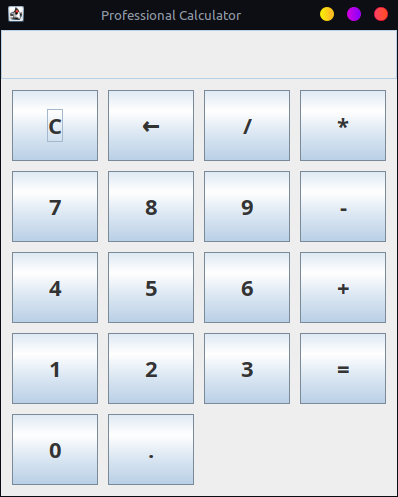

# Java GUI Calculator

This is a simple GUI-based Calculator built using Java Swing.  
It supports basic arithmetic operations like addition, subtraction, multiplication, and division.

---

## 🖥️ Features

- Simple and intuitive GUI
- Basic operations: +, –, ×, ÷
- Responsive layout using Java Swing
- Calculator icon included

---

calculator/

├── Calculator.java        
├── Calculator.class      
├── Calculator$1.class   
├── calculator.png          
├── README.md              
└── requirements.txt        

---

📸 Calculator



---

## 🛠️ Requirements

- Java Development Kit (JDK) 8 or later

---

## 🚀 How to Run

### 1. Compile the code
```bash
javac Calculator.java

java Calculator
